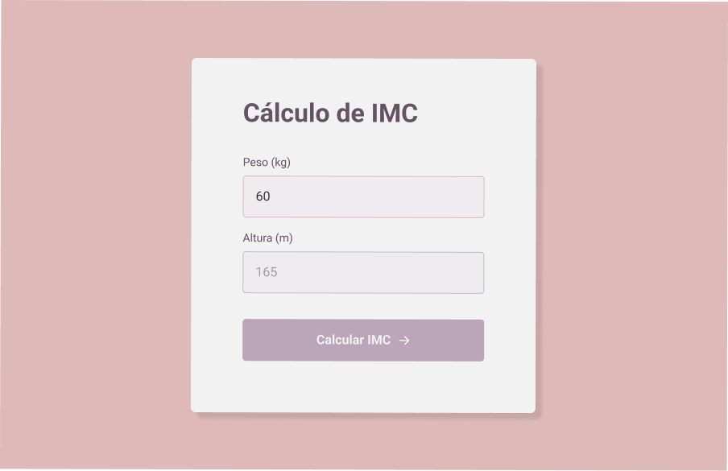

<h1 align="center"> Calculadora de IMC </h1>

 

  <a href="#-tecnologias">Tecnologias</a>&nbsp;&nbsp;&nbsp;|&nbsp;&nbsp;&nbsp;
  <a href="#-descrição">Descrição</a>&nbsp;&nbsp;&nbsp;|&nbsp;&nbsp;&nbsp;
  <a href="#confira-o-projeto">Confira o projeto</a>&nbsp;&nbsp;&nbsp;

  

## 🚀 Tecnologias

Esse projeto foi desenvolvido com as seguintes tecnologias:

- HTML
- CSS
- JavaScript
- Figma
- Git e Github

---

 

## 💻 Descrição

Calculadora de IMC baseada no peso e altura do usuário, contando com as funcionalidades:

- Formulário para inserir os dados do usuário
- Resultado do cálculo do IMC apresentado em um popup ao clicar no botão "calcular"
- Mensagem de erro após validação dos dados, caso estes não sejam números

 

### 🔑 Acesse o projeto!

[Calculadora de IMC](https://eduvieira131.github.io/Calculadora-de-IMC/)

---

## Confira o projeto:

  Uma pequena amostra sobre o que esperar do projeto!

 

  

